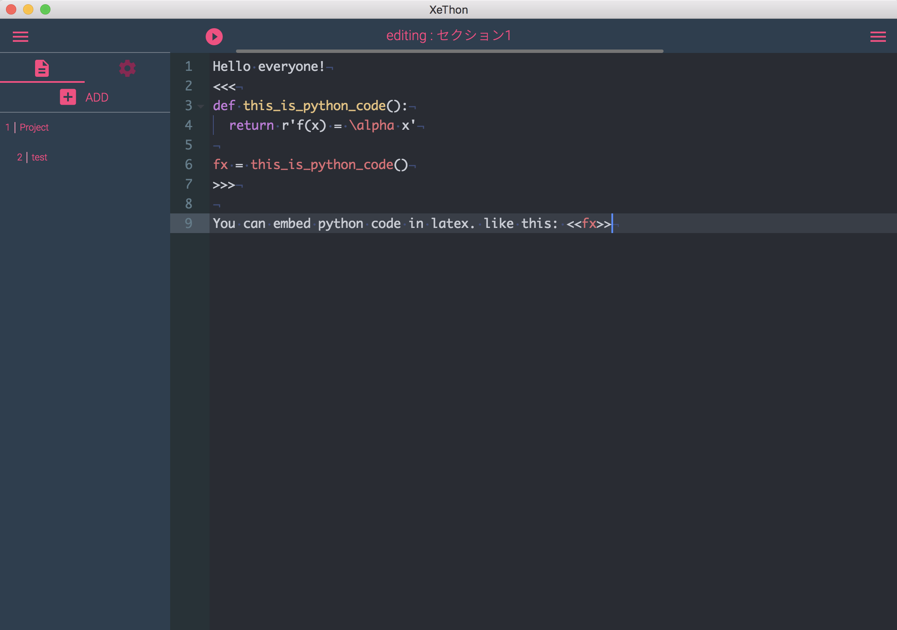

# XeThon

super tex IDE

# Current Progress


## Setup
If nodejs isn't installed in your os, you need to install nodejs. Though there are several ways to install nodejs, I show you one way.

First, install homebrew if you don't have.
```
$ /usr/bin/ruby -e "$(curl -fsSL https://raw.githubusercontent.com/Homebrew/install/master/install)"

$ brew -v
homebrew x.x.x
```

Then, with homebrew, install nodebrew which is in use to manage nodejs.
```
$ brew install nodebrew

$ nodebrew setup

$ nodebrew help
```

And install nodejs.
```
$ nodebrew install-binary v7.5.0

$ nodebrew use v7.5.0

$ vim ~/.bash_profile

# Add this code in bash_profile. And press " i " key to insert code with vim.
export PATH=$HOME/.nodebrew/current/bin:$PATH

# Then press three keys to save and close bash_profile.
:wq

$ source ~/.bash_profile

$ node -v
v7.5.0
```

Finally, you can setup our develop environment.
```
$ git clone https://github.com/RealTwo-Space/XeThon.git

$ cd XeThon

$ npm install
```

Now, you have just installed requirements to develop this project. So let's develop!

If you want to start up this app, run this command.
```
$ npm start
```

And, if you want to build this app, try this command.
```
$ npm run build
```

## Utilities

1. generate a bunch of react component with redux and scss
```
$ bin/react/react.sh generate <ComponentName>
```

2. auto-compile sass
```
$ npm run sass
```

### gen a bunch of react component with redux and scss
Before using this command, you have to check weather gnu-sed is installed in your os or not. That is because this generator uses gnu-sed to auto-import. So if you don't have gnu-sed, install it with homebrew.
```
$ brew install gnu-sed
```

If you want to create a set of react component with redux, run this command.
```
$ bin/react/react.sh generate <ComponentName>
```
Domain folder and files (component, reducer, action, scss) will be created. And reducer and scss will be imported to rootReducer.jsx and style.scss automatically.

```
app/frontend/
componentName _ ComponentName.jsx
             |_ componentNameAction.jsx
             |_ componentNameReducer.jsx

app/frontend/assets/sass/component/_compoentName.scss
```
```
app/frontend/rootReducer.jsx

//reducers import
import componentName from './componentName/componentName';

const rootReducer = combineReducers({
//reducers
  componentName,
});
```
```
app/assets/sass/style.scss

//components
@import "components/compoentName";
```
